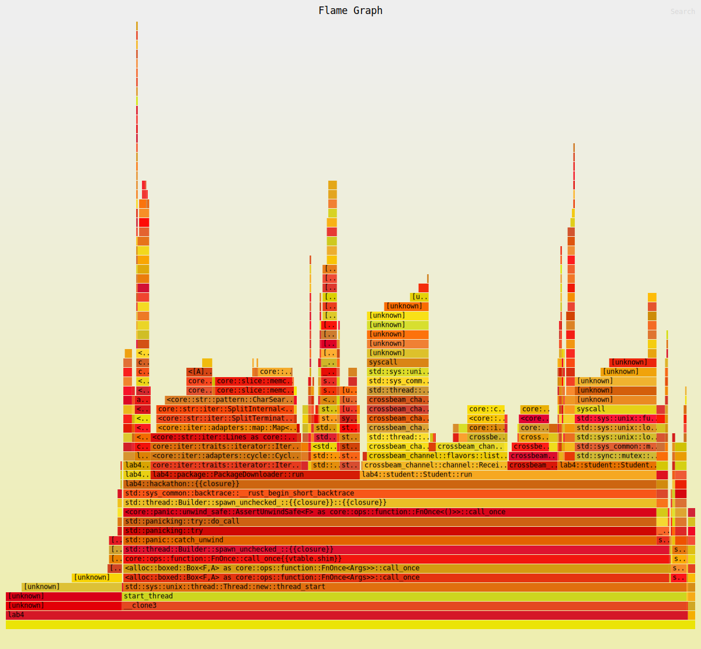
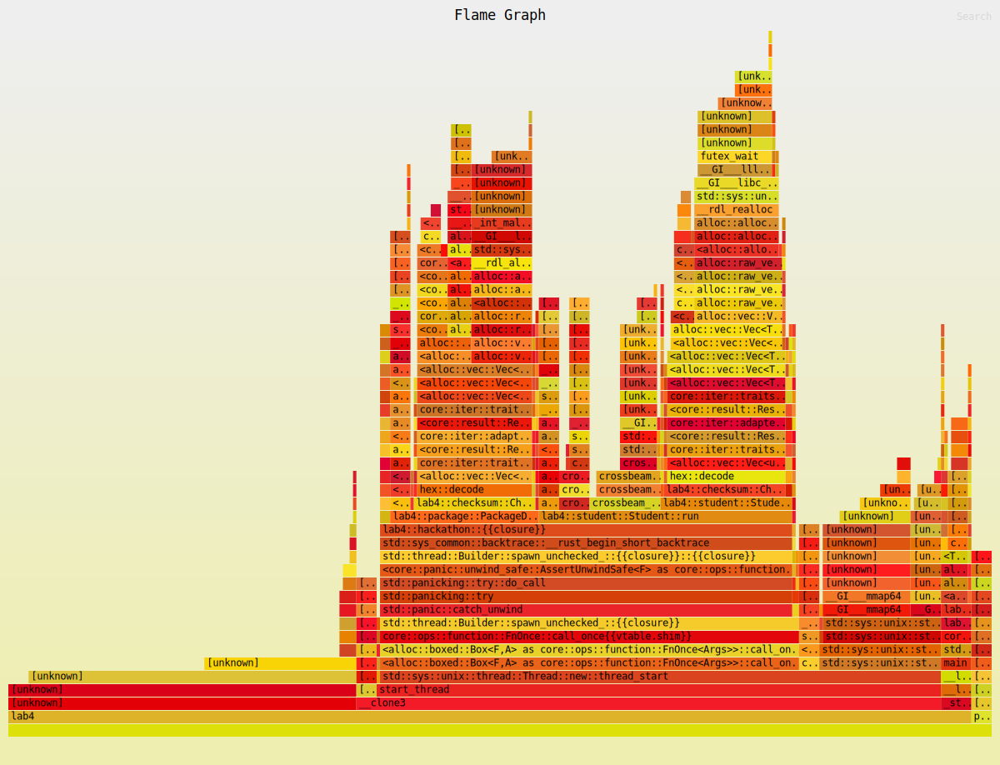

# Title

Optimizing Performance using CPU Profiling Tools

# Summary

Before beginning any optimization a flamegraph was genereated to determine where CPU time was going in the program. 
After each revision a new flamegraph was created to see the new breakdown of CPU usage. The main changes include 
moving all I/O operations to the main thread to eliminate constant reads for the same set of data, this also included
performing the cross product operation once in the main thread and cloning the result into each ideas thread. Further, 
analysis showed much of the CPU usage was spent on lock contention for the checksum value mutex locks. Therefore, each thread 
now manages its own partial checksum value and the complete checksum is somputed once each set of threads finishes. Additionally, 
all threads are now deployed in parrallel, so that the first set of threads can start doing work while the rest continue to be 
deployed. Lastly, the program is now compiled with link time optimizations to further boost performance. 

# Technical details

On the first pass, a large fraction of the CPU time went to the iterator in the `PackageDownloader::run` threads, and the `get_next_idea_name` 
method in `idea.rs`. Upon investigation, using the principle of "doing less work" applied here to optimize the performance. Since the values 
from the file are static upon runtime, performing mutliple reads on each iteration of the loop was unnecessary. The I/O operations were moved to 
the main thread and only occur once, the neccessay data is constructed and then copied to the seperate worker threads. These changes resulted in significant
gains in performance. 

```rust
// Read in all I/O first
let pkgs = get_packages(args.num_pkgs, &args.packages_file);
let ideas_vec = generate_ideas_vec(&args.product_ideas_file, &args.customer_ideas_file);
```

Next, it was found that while the student threads were spawned first, none where unable to start doing any work until the first
idea thread was generated - which occurs after all the package threads are spawned. Rather than having the threads waiting around 
unable to perform any work the threads are now deployed so that a set of a idea, student and package thread are spawned together. This way the
first set of student threads can start doing work while the remaining threads continue to be spawned. Below is a pseudo-code example of the changes :

```c
// Before
for i in num_student_threads: 
  spawn()

for i in num_download_threads: 
  spawn()

for i in num_idea_threads: 
  spawn()

// Now 
while all threads are not spawned: 
  spawn(student_thread) 
  spawn(download_thread)
  spawn(idea_thread)
```

Lastly, from the profiling analysis it was found that a large portion of the CPU time was tied up in lock contention for the checksum values. 
There was not a way to reduce the critical section in a meaningful way, and since the operations required concurrent writes, using a method 
such as `Rwlock` was not applicable since it only allows concurrent reads. Therefore, instead of having each thread update a global checksum value
the checksum values were managed by each thread. Then once all the threads finished execution the partial checksum values were combined. **Note:** This 
does not elimate any work from the base code, since the same number of `checksum.update()` operations occur, instead the values are synchronized 
once all threads finish, rather then concurrently. Finally, the program was compiled using link time optimization for further compiler optimizations. 

# Testing for correctness

To validate correctness, both the baseline and optimized versions of the program were executed on the same parameters, for a range of parameters. The
checksums were compared for both to ensure that they were exact. We can see from some of the results below that the checksums are exact between the tests. 

Results: 
```sh
cargo run --release -- 80 2 4000 6 6
[Optimized Output]
Idea Generator: bf1ecead4b6b5a4866729ce33057a33e3612a1e388980616d8d78c77122eb9ed
Student Idea: bf1ecead4b6b5a4866729ce33057a33e3612a1e388980616d8d78c77122eb9ed
Package Downloader: 40bee7e9ca0d6e1c7b9fd92eb882558f4abb64cb285af4af6ab507e8494e6d9c
Student Package: 40bee7e9ca0d6e1c7b9fd92eb882558f4abb64cb285af4af6ab507e8494e6d9c

[Base Output]
Idea Generator: bf1ecead4b6b5a4866729ce33057a33e3612a1e388980616d8d78c77122eb9ed
Student Idea: bf1ecead4b6b5a4866729ce33057a33e3612a1e388980616d8d78c77122eb9ed
Package Downloader: 40bee7e9ca0d6e1c7b9fd92eb882558f4abb64cb285af4af6ab507e8494e6d9c
Student Package: 40bee7e9ca0d6e1c7b9fd92eb882558f4abb64cb285af4af6ab507e8494e6d9c

cargo run --release -- 400 32 10000 64 64
[Optimized Output]
Idea Generator: fe32cf56b349eed5a10286902d63d5b7e1a31c94d4d4f247ed7e44b40f095ecc
Student Idea: fe32cf56b349eed5a10286902d63d5b7e1a31c94d4d4f247ed7e44b40f095ecc
Package Downloader: 38ebe1f22fc394729d9628c0cb86ce052ca62470e29b1afacf1ee6e02b4934e4
Student Package: 38ebe1f22fc394729d9628c0cb86ce052ca62470e29b1afacf1ee6e02b4934e4

[Base Output]
Idea Generator: fe32cf56b349eed5a10286902d63d5b7e1a31c94d4d4f247ed7e44b40f095ecc
Student Idea: fe32cf56b349eed5a10286902d63d5b7e1a31c94d4d4f247ed7e44b40f095ecc
Package Downloader: 38ebe1f22fc394729d9628c0cb86ce052ca62470e29b1afacf1ee6e02b4934e4
Student Package: 38ebe1f22fc394729d9628c0cb86ce052ca62470e29b1afacf1ee6e02b4934e4
```

# Testing for performance.

An initial flamegraph was generated below along with a flamegraph of the final optimized program. We can 
see that in the final optimized code flamegraph that the majority of the CPU usage goes towards setting up and
running the main program, the threads and the `checksum::update` function - which is a stand-in for download time. Therefore, 
we can see that the core program functions cannot be optimized in any meaningful way. 

Further, hyperfine was used to evaluate the performance between the baseline and optimized code both on the local 
machine and the ECE servers, the results can be found below. 

**Baseline Flamegraph:**



**Optimized Flamegraph:**



Further, a set of tests between the baseline and optimized code were executed on a local machine and the ECE servers. THe
results are below, which indicate a larger performance increase in the optimized code. 

## Locally Tested: 

Baseline code: 
```sh
❯ hyperfine --warmup 25 --min-runs 50 -i 'target/release/lab4' --shell=none 
Benchmark 1: target/release/lab4
  Time (mean ± σ):      89.9 ms ±   9.0 ms    [User: 639.8 ms, System: 86.9 ms]
  Range (min … max):    72.9 ms … 109.7 ms    50 runs
```

Optimized code:
```sh
❯ hyperfine --warmup 25 --min-runs 50 -i 'target/release/lab4' --shell=none 
Benchmark 1: target/release/lab4
  Time (mean ± σ):       7.2 ms ±   1.3 ms    [User: 22.9 ms, System: 6.4 ms]
  Range (min … max):     4.8 ms …  16.4 ms    388 runs
```

## Tested on ECE Servers: 

Baseline code: 
```sh
eceubuntu4:~/ece459-1231-a4-upistek> hyperfine --warmup 25 --min-runs 50 -i 'target/release/lab4'
Benchmark #1: target/release/lab4
  Time (mean ± σ):     759.3 ms ± 117.2 ms    [User: 1.201 s, System: 0.077 s]
  Range (min … max):   525.0 ms … 1001.2 ms    50 runs
```

Optimized code:
```sh
eceubuntu4:~/performance_programming_ece459/a4_profiling> hyperfine --warmup 25 --min-runs 50 -i 'target/release/lab4'
Benchmark #1: target/release/lab4
  Time (mean ± σ):      56.6 ms ±  18.7 ms    [User: 37.3 ms, System: 3.0 ms]
  Range (min … max):    29.2 ms … 133.2 ms    60 runs
```
